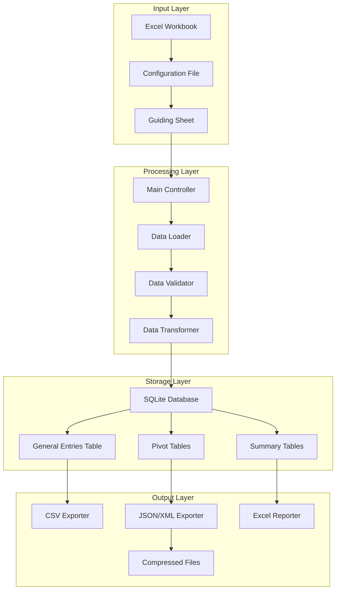
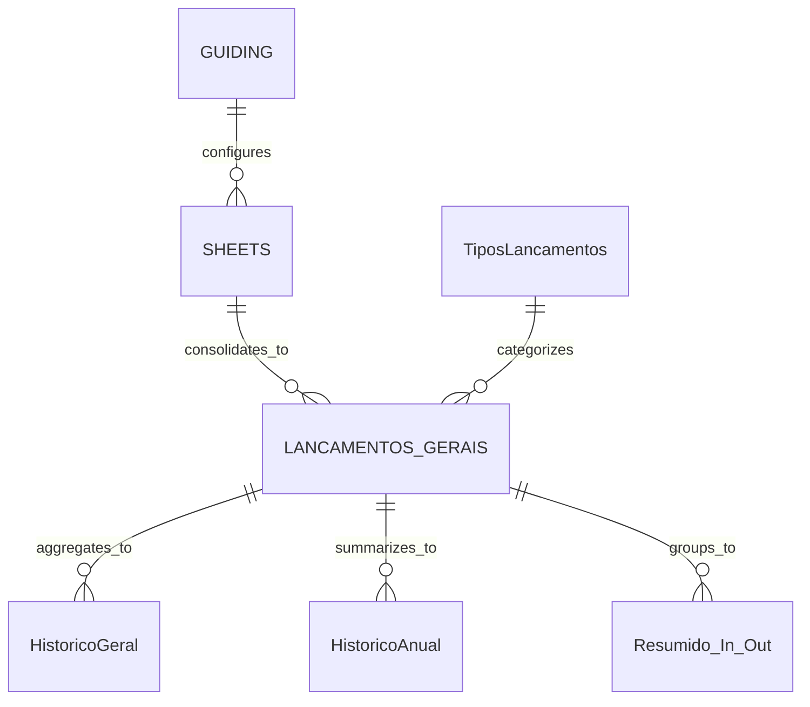

# Design Document

## Overview

The Personal Data Warehouse (PDW) is designed as a modular ETL system with a layered architecture that separates concerns between data extraction, transformation, storage, and reporting. The system follows a configuration-driven approach where behavior is controlled through external configuration files and Excel-based metadata sheets.

The architecture emphasizes data integrity, performance, and extensibility while maintaining simplicity for end-user operation. The system processes financial data through a pipeline that includes validation, normalization, aggregation, and multi-format export capabilities.

## Architecture

### System Architecture Diagram



### Component Architecture

The system is organized into the following main components:

1. **Main Controller** (`main.py`): Orchestrates the entire ETL process
2. **ETL Module** (`etl/`): Handles data extraction, transformation, and loading
3. **Database Module** (`database/`): Manages database operations and schema
4. **Utils Module** (`utils/`): Provides data processing utilities and helpers
5. **Reports Module** (`reports/`): Generates various output formats and reports
6. **Importers Module** (`importers/`): Handles specialized data import operations

## Components and Interfaces

### Main Controller Component

**Purpose**: Central orchestration of the ETL pipeline

**Key Responsibilities**:
- Configuration management and validation
- Process flow control and sequencing
- Error handling and logging
- Performance monitoring and reporting

**Interfaces**:
```python
def main(param_file: str) -> None
    """
    Main entry point for the PDW system
    Args:
        param_file: Path to configuration file (optional)
    """
```

**Key Configuration Parameters**:
- Directory paths (input, output, database, logs)
- File types and naming conventions
- Processing flags (run_loader, run_reports, create_pivot)
- Database settings (overwrite_db, save_discarded_data)

### ETL Data Loader Component

**Purpose**: Extract data from Excel sheets and load into SQLite database

**Key Responsibilities**:
- Excel workbook parsing and sheet processing
- Data type conversion and validation
- General entries table consolidation
- Batch processing and transaction management

**Interfaces**:
```python
def data_loader(
    data_base: str,
    types_sheet: str,
    general_entries_table: str,
    data_origin_col: str,
    guiding_sheet: str,
    excel_file: str,
    save_useless: bool,
    udt: str
) -> None
```

**Data Flow**:
1. Read guiding sheet configuration
2. Process each sheet based on loadable/accounting flags
3. Apply data transformations and validations
4. Consolidate accounting entries into general table
5. Commit transactions and close connections

### Data Transformation Component

**Purpose**: Normalize and enrich raw data for analysis

**Key Transformations**:
- Date parsing and component extraction (day, month, year, day of week)
- Numeric conversion with rounding for financial amounts
- Text normalization (special character replacement, trimming)
- Data validation and null handling
- Sorting and indexing for performance

**Data Enrichment**:
- Month names in Portuguese
- Day of week names in Portuguese
- Year-month combinations for grouping
- Data source tracking (Origem column)

### Pivot Table Generator Component

**Purpose**: Create analytical pivot tables for trend analysis

**Key Responsibilities**:
- Monthly aggregation by transaction type
- Annual aggregation by transaction type
- Both sum and count aggregations
- Dynamic column ordering based on transaction types

**Generated Tables**:
- `HistoricoGeral`: Monthly sums by transaction type
- `HistoricoGeral_QTD`: Monthly counts by transaction type
- `HistoricoAnual`: Annual sums by transaction type
- `HistoricoAnual_QTD`: Annual counts by transaction type

### Dynamic Reports Component

**Purpose**: Generate configurable analytical reports

**Key Responsibilities**:
- Report definition parsing from Excel sheets
- Dynamic SQL generation based on column specifications
- Custom aggregation and calculation logic
- Flexible report table creation

**Report Configuration Schema**:
- `DEST_TABLE`: Target table name for report
- `SHEETY`: Source sheet containing column definitions
- `REPORT_NAME`: Descriptive name for the report
- `COLUMN_NAME`: Columns to include in aggregation

### Export and Reporting Component

**Purpose**: Generate output files in multiple formats

**Supported Formats**:
- CSV with semicolon separators and CP1252 encoding
- JSON with line-oriented format and UTF-8 encoding
- XML with custom schema and pretty printing
- Excel workbooks with multiple sheets and formatting
- Compressed formats (gzip) for large files

**Export Features**:
- Locale-specific number formatting (comma as decimal separator)
- Date formatting for Brazilian locale (DD-MM-YYYY)
- Character encoding handling for Portuguese text
- File compression for space optimization

## Data Models

### Core Data Entities

#### General Entries Table (LANCAMENTOS_GERAIS)
```sql
CREATE TABLE LANCAMENTOS_GERAIS (
    Data DATE NOT NULL,
    DIA_SEMANA TEXT,
    TIPO TEXT NOT NULL,
    DESCRICAO TEXT,
    Credito REAL DEFAULT 0,
    Debito REAL DEFAULT 0,
    Mes TEXT,
    Ano TEXT,
    MES_EXTENSO TEXT,
    AnoMes TEXT,
    Origem TEXT
);
```

#### Transaction Types Table (TiposLancamentos)
```sql
CREATE TABLE TiposLancamentos (
    Código TEXT PRIMARY KEY,
    Descrição TEXT NOT NULL
);
```

#### Guiding Configuration Table (GUIDING)
```sql
CREATE TABLE GUIDING (
    TABLE_NAME TEXT PRIMARY KEY,
    ACCOUNTING TEXT,
    CLEANABLE TEXT,
    LOADABLE TEXT
);
```

#### Monthly Summary Table (Resumido_In_Out)
```sql
CREATE TABLE Resumido_In_Out (
    AnoMes TEXT,
    Origem TEXT,
    CREDITO REAL,
    DEBITO REAL,
    Posição REAL
);
```

### Data Relationships



## Error Handling

### Error Categories and Strategies

#### Configuration Errors
- **File Not Found**: Terminate with clear error message
- **Version Mismatch**: Validate configuration version against system version
- **Invalid Parameters**: Validate all configuration values before processing
- **Directory Access**: Check directory existence and permissions

#### Data Processing Errors
- **Invalid Excel Files**: Handle corrupted or inaccessible workbooks
- **Missing Sheets**: Skip missing sheets with warning messages
- **Data Type Conversion**: Use pandas error handling with coerce option
- **Null Value Handling**: Configurable behavior for null/empty values

#### Database Errors
- **Connection Failures**: Retry logic with exponential backoff
- **Transaction Rollback**: Automatic rollback on error with cleanup
- **Schema Conflicts**: Drop and recreate tables when overwrite is enabled
- **Disk Space**: Monitor available space before large operations

#### Export Errors
- **File Permission Issues**: Check write permissions before export
- **Encoding Problems**: Handle character encoding for international text
- **Large File Handling**: Stream processing for memory efficiency
- **Compression Failures**: Fallback to uncompressed files

### Error Recovery Mechanisms

1. **Graceful Degradation**: Continue processing valid data when encountering errors
2. **Transaction Isolation**: Use database transactions to ensure data consistency
3. **Checkpoint Recovery**: Save progress at key milestones for restart capability
4. **Detailed Logging**: Comprehensive error logging for troubleshooting

## Testing Strategy

### Unit Testing Approach

#### Data Transformation Tests
- **Date Parsing**: Validate date component extraction accuracy
- **Numeric Conversion**: Test financial amount conversion and rounding
- **Text Normalization**: Verify special character handling and trimming
- **Null Handling**: Test behavior with various null/empty value scenarios

#### Database Operation Tests
- **Connection Management**: Test connection pooling and cleanup
- **Transaction Handling**: Verify commit/rollback behavior
- **Schema Creation**: Test table creation and index management
- **Data Integrity**: Validate foreign key relationships and constraints

#### Configuration Tests
- **Parameter Validation**: Test all configuration parameter combinations
- **File Path Handling**: Test various path formats and edge cases
- **Version Compatibility**: Test version matching logic
- **Default Value Handling**: Verify behavior with missing configuration values

### Integration Testing Approach

#### End-to-End Pipeline Tests
- **Complete ETL Flow**: Test full pipeline with sample data
- **Multi-Sheet Processing**: Validate handling of complex Excel workbooks
- **Report Generation**: Test all export formats and compression
- **Error Scenarios**: Test system behavior under various error conditions

#### Performance Testing
- **Large Dataset Processing**: Test with realistic data volumes
- **Memory Usage**: Monitor memory consumption during processing
- **Database Performance**: Test query performance with large tables
- **Export Performance**: Measure export times for various formats

### Data Quality Testing

#### Data Validation Tests
- **Business Rule Validation**: Test financial calculation accuracy
- **Data Consistency**: Verify data integrity across transformations
- **Aggregation Accuracy**: Validate pivot table calculations
- **Report Accuracy**: Cross-check report outputs against source data

#### Regression Testing
- **Output Comparison**: Compare outputs across system versions
- **Performance Regression**: Monitor performance metrics over time
- **Configuration Compatibility**: Test backward compatibility
- **Data Migration**: Validate data consistency during upgrades

## Performance Considerations

### Optimization Strategies

#### Memory Management
- **Streaming Processing**: Process large datasets in chunks
- **DataFrame Optimization**: Use efficient pandas operations
- **Memory Monitoring**: Track memory usage during processing
- **Garbage Collection**: Explicit cleanup of large objects

#### Database Performance
- **Index Strategy**: Create indexes on frequently queried columns
- **Batch Operations**: Use bulk insert operations for large datasets
- **Connection Pooling**: Reuse database connections efficiently
- **Query Optimization**: Use efficient SQL patterns and avoid N+1 queries

#### File I/O Optimization
- **Buffered Reading**: Use appropriate buffer sizes for file operations
- **Parallel Processing**: Consider parallel processing for independent operations
- **Compression**: Use compression for large export files
- **Temporary Files**: Manage temporary file cleanup

### Scalability Considerations

#### Data Volume Scaling
- **Partitioning Strategy**: Consider data partitioning for very large datasets
- **Archive Strategy**: Implement data archiving for historical data
- **Incremental Processing**: Support incremental data updates
- **Resource Monitoring**: Monitor CPU, memory, and disk usage

#### Concurrent Processing
- **Thread Safety**: Ensure thread-safe operations for future parallelization
- **Lock Management**: Minimize database lock contention
- **Resource Sharing**: Efficient sharing of database connections
- **Process Isolation**: Isolate independent processing tasks