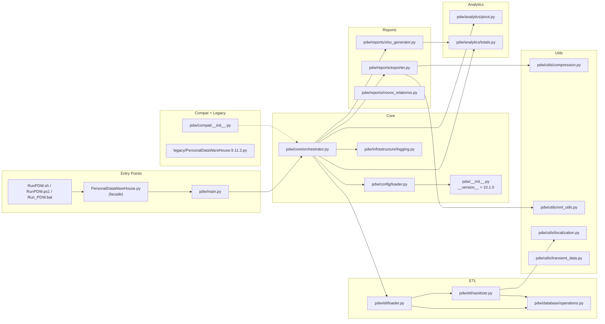
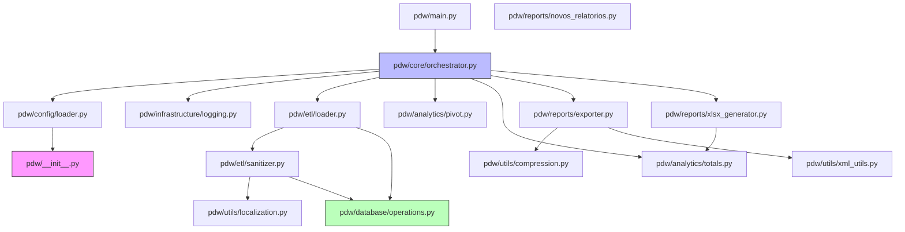
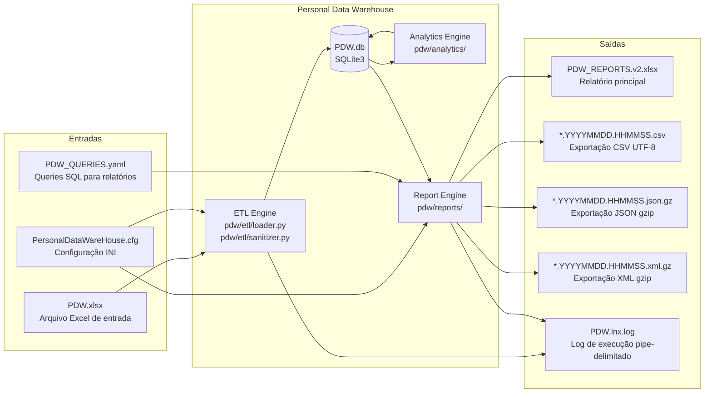
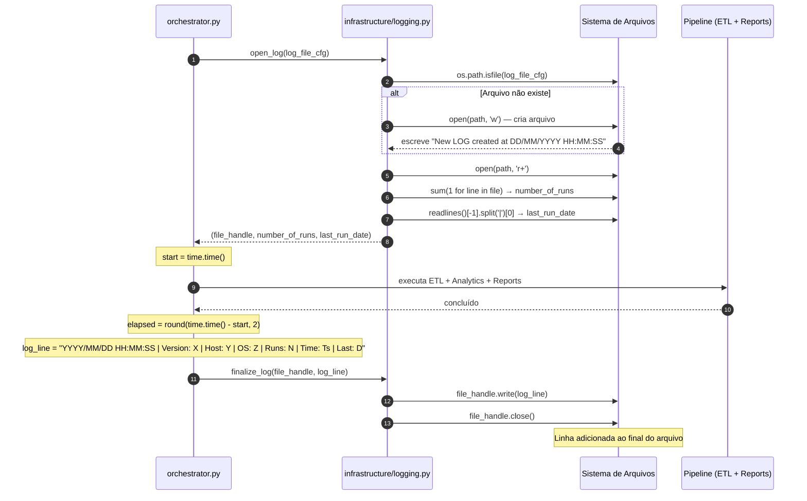
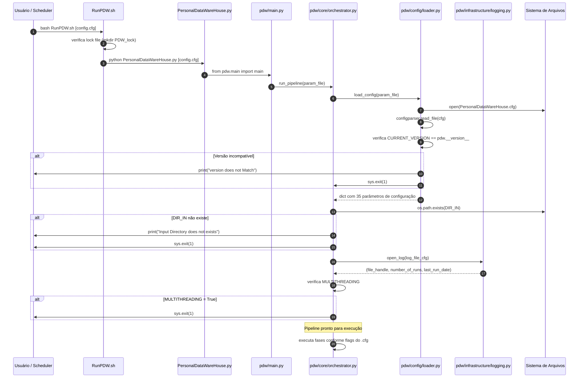
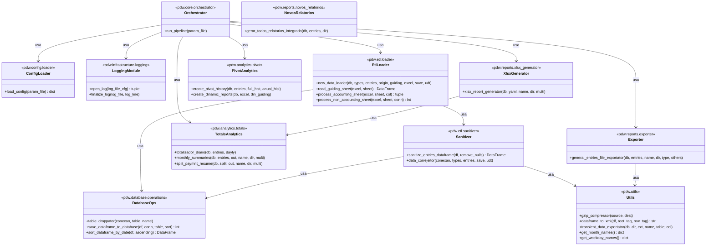
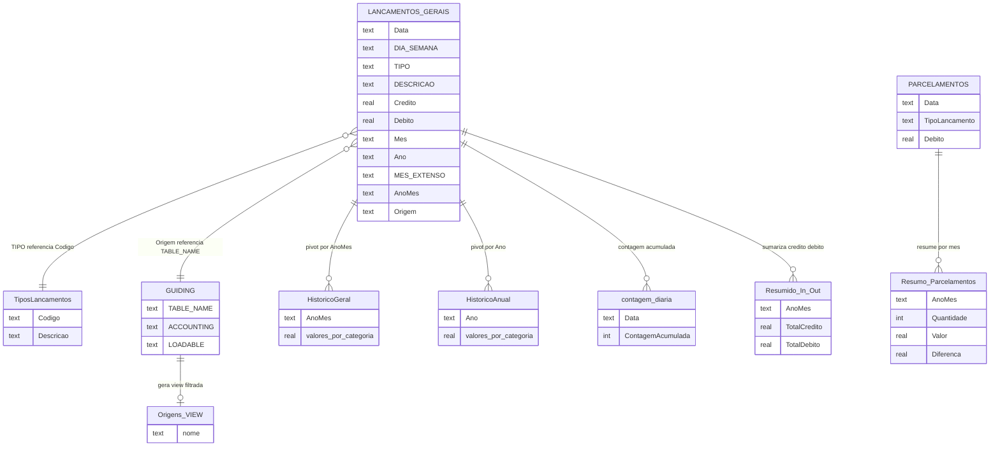
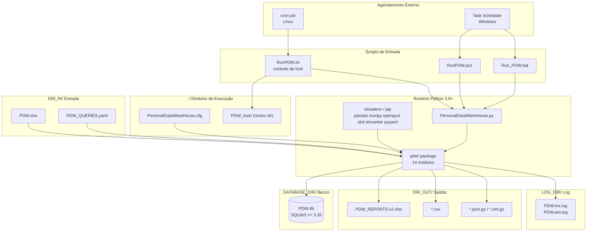

# DIAGRAMA_ARQUITETURA.md
## Personal Data Warehouse — Diagramas de Arquitetura Mermaid
### Versão 10.1.0

> Todos os diagramas usam sintaxe **Mermaid** e são renderizados automaticamente no GitHub.

---

## 1. Diagrama de Módulos

Estrutura completa do pacote `pdw/` agrupada por responsabilidade.

---

## 2. Diagrama de Dependências

Grafo de importações entre módulos. Setas indicam "importa de". Sem ciclos.

---

## 3. Diagrama de Fluxo de Execução

Pipeline completo com todas as ramificações condicionais.

```mermaid
flowchart TD
    A([Início]) --> CLI["CLI: python PersonalDataWareHouse.py"]
    CLI --> PDW_MAIN["pdw/main.py :: main()"]
    PDW_MAIN --> PIPE["orchestrator.py :: run_pipeline()"]

    PIPE --> LCFG["load_config(param_file)"]
    LCFG --> VER{Versão\ncompatível?}
    VER -- Não --> E1([exit 1])
    VER -- Sim --> DIRS{Diretórios\nexistem?}
    DIRS -- Não --> E2([exit 1])
    DIRS -- Sim --> OPLOG["open_log()"]

    OPLOG --> MT{MULTITHREADING\n= True?}
    MT -- Sim --> E3([exit 1])
    MT -- Não --> RLD{RUN_DATA\nLOADER?}

    RLD -- Sim --> ETL["new_data_loader()"]
    ETL --> READ["read_guiding_sheet()"]
    READ --> LOOP["Para cada aba no GUIDING"]
    LOOP --> ACCNT{ACCOUNTING\n= X?}
    ACCNT -- Sim --> PACC["process_accounting_sheet()"]
    ACCNT -- Não --> PNACC["process_non_accounting_sheet()"]
    PACC --> CONCAT["pd.concat(all_entries)"]
    PNACC --> CONCAT
    CONCAT --> SANIT["sanitize_entries_dataframe()"]
    SANIT --> SAVDB["save_dataframe_to_database()"]
    SAVDB --> CORR["data_correjeitor()"]
    CORR --> PIV_Q{CREATE\nPIVOT?}
    RLD -- Não --> PIV_Q

    PIV_Q -- Sim --> PIVO["create_pivot_history()"]
    PIVO --> DIN_Q{RUN_DINAMIC\nREPORT?}
    DIN_Q -- Sim --> DINR["create_dinamic_reports()"]
    DINR --> RPT_Q{RUN\nREPORTS?}
    DIN_Q -- Não --> RPT_Q
    PIV_Q -- Não --> RPT_Q

    RPT_Q -- Sim --> SUMM["monthly_summaries()"]
    SUMM --> EXPRT["general_entries_file_exportator()"]
    EXPRT --> SPLIT["split_paymnt_resume()"]
    SPLIT --> XLSX["xlsx_report_generator()"]
    XLSX --> FLOG["finalize_log()"]
    RPT_Q -- Não --> FLOG

    FLOG --> DONE([exit 0])
```

---

## 4. Diagrama de Integração Externa

Todas as dependências de arquivos e sistemas externos ao processo PDW.

---

## 5. Diagrama de Camadas

Arquitetura em camadas do sistema. Dependências fluem de cima para baixo.

```mermaid
graph TB
    subgraph L1["Camada 1 — Entry Point"]
        EP1["PersonalDataWareHouse.py (facade)"]
        EP2["pdw/main.py"]
        EP3["RunPDW.sh / RunPDW.ps1 / Run_PDW.bat"]
    end

    subgraph L2["Camada 2 — Orquestração"]
        OR1["pdw/core/orchestrator.py\nrun_pipeline()"]
        OR2["pdw/config/loader.py\nload_config()"]
        OR3["pdw/infrastructure/logging.py\nopen_log() / finalize_log()"]
    end

    subgraph L3["Camada 3 — Domínio de Negócio"]
        D1["pdw/etl/loader.py\nnew_data_loader()"]
        D2["pdw/etl/sanitizer.py\nsanitize_entries_dataframe()"]
        D3["pdw/analytics/pivot.py\ncreate_pivot_history()"]
        D4["pdw/analytics/totals.py\nmonthly_summaries()"]
        D5["pdw/reports/exporter.py\ngeneral_entries_file_exportator()"]
        D6["pdw/reports/xlsx_generator.py\nxlsx_report_generator()"]
    end

    subgraph L4["Camada 4 — Infraestrutura Técnica"]
        I1["pdw/database/operations.py\ntable_droppator() / save_dataframe_to_database()"]
        I2["pdw/utils/compression.py\ngzip_compressor()"]
        I3["pdw/utils/xml_utils.py\ndataframe_to_xml()"]
        I4["pdw/utils/localization.py\nget_month_names() / get_weekday_names()"]
    end

    subgraph L5["Camada 5 — Recursos Externos"]
        EX1[("PDW.db — SQLite3")]
        EX2["PDW.xlsx — Excel"]
        EX3["PersonalDataWareHouse.cfg — INI"]
        EX4["PDW_QUERIES.yaml — YAML"]
        EX5["Sistema de Arquivos — log / output"]
    end

    L1 --> L2
    L2 --> L3
    L3 --> L4
    L4 --> L5
```

---

## 6. Diagrama de Logging

Ciclo de vida completo do arquivo de log em uma execução.

---

## 7. Diagrama de Inicialização da Aplicação

Sequência completa desde a invocação CLI até o início do pipeline.

---

## 8. Diagrama de Endpoints

Todas as 26 funções públicas agrupadas por módulo responsável.

---

## 9. Diagrama de Persistência

Schema completo do banco SQLite com relacionamentos lógicos entre tabelas.

---

## 10. Diagrama de Deploy

Topologia completa de implantação do PDW em ambiente local.

